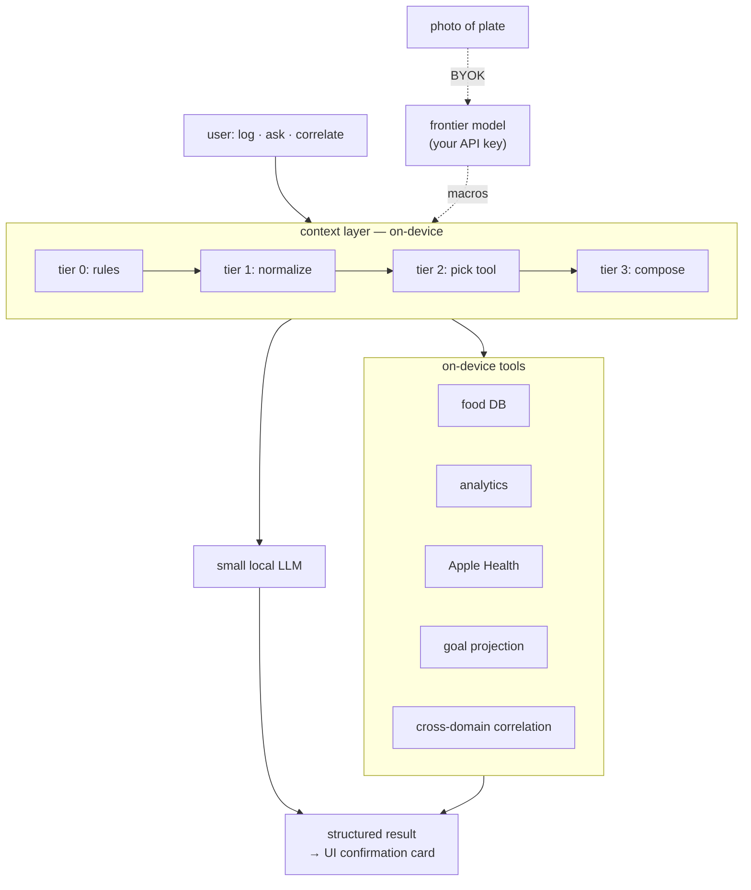
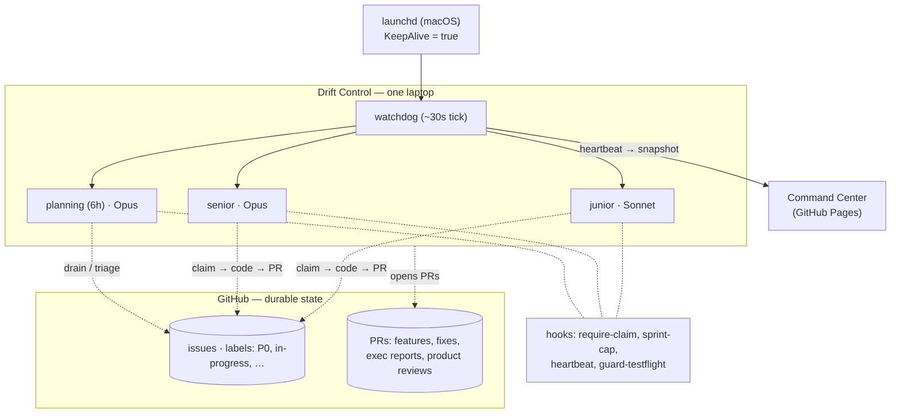

# The app that ships itself

*Notes on harness engineering for a one-person autonomous dev loop.*

---

For years I've been the person at dinner who asks about your HRV. Eight health apps on my phone, each charging me twenty bucks a month, and none of them talked to each other. If I wanted to ask *"does rice actually spike my glucose?"*, the answer was a spreadsheet. Ridiculous.

The SaaS era had a quiet assumption: you rent software from someone. Language models broke that. Anyone with an outcome in mind and a laptop can now build their own tool. So I built mine.

**Drift** is an iOS health app I wrote no iOS code for. A small language model runs on-device; twenty Swift tools do the analytics; a bring-your-own-key path handles photo meal logging (the one thing a frontier model is honestly better at). No server on my end. Zero cost to keep it running. Try it — the public beta is [on TestFlight](https://testflight.apple.com/join/NDxkRwRq).

**Twenty-five friends and friends-of-friends use it now.** Two of them cancelled a $20-a-month subscription elsewhere. Their bug reports and reactions are how I scale taste across a user base that isn't just me.

But the interesting engineering isn't the app. It's the *harness* I wired around Claude Code that ships Drift while I sleep. A bash `while true` — what Geoffrey Huntley calls a [Ralph loop](https://ghuntley.com/ralph/) — plus the scaffolding I had to build to keep ordinary language-model sessions from drifting over weeks of unattended running.

Every tool call the agent makes writes a timestamp to a file. The watchdog reads that heartbeat to decide the loop is still alive. My phone renders it as an ECG strip. When the line goes flat at 11pm, I know.

Last week that scaffolding pushed **409 commits** into Drift's repo. It closed **30 bug issues**, most filed by real people on TestFlight, average close time around eleven minutes. *I wrote none of that code. I read some of the reviews.*

Two things live side by side in this post:

- **Drift** — the iOS app. The dish.
- **Drift Control** — the harness that builds it. The kitchen.

This post is mostly about the kitchen.

---

## drift, briefly

Phones have finite memory, so the on-device model has to be small. A small model is not a smart model — but small models are reliably good at one thing: **tool calling**. Give them a clear toolbox, they read the query, pick the right tool, fill in its parameters, and return a structured result. That's the shape of almost every question a health app actually gets.

So I broke Drift down into roughly twenty tools, each a Swift function over one slice of data — food log, weight, workouts, Apple Health (including CGM glucose), goal projection, cross-domain correlation, trend projection. The model doesn't *do* the analysis; it picks the tool and routes the answer to the UI.



A small model given the right five facts behaves fine. Given twenty thousand tokens of noise it doesn't, and prompt tweaking won't save it. The scaffolding does.

One more choice worth naming: **no-"server" architecture.** No accounts. No subscription. No backend on my side. Even photo meal logging goes directly from your phone to your API key — the only payload on the wire is the photo.

That's the app. The interesting part is what builds it.

---

## the kitchen, one picture



A watchdog ticks every thirty seconds. When nothing is running, it spawns one of three session types: **planning** (Opus, every six hours), **senior** (Opus, complex work), **junior** (Sonnet, simpler tasks). Each session works one bounded unit and exits. Progress lives in git, not in the model's memory. That's Ralph.

The rest of this essay is the scaffolding I built around Ralph — five patterns, one per section, each from a specific failure.

---

## 1 — ground truth, not memory

One Saturday the watchdog ran eleven planning sessions in four hours and shipped nothing. The planning-due check read a stamp file each session was supposed to write when it finished — and the sessions kept dying before writing. The harness was asking itself *when did I last plan?* and the answer was, forever, *never.*

No more session-written stamps. Every gate reconciles against the durable store: `git log`, the GitHub API, the filesystem. More API calls. Worth it.

> Anti-patterns: read-then-claim in two calls; trusting in-memory state across a crash; a stamp file as the source of truth.

---

## 2 — hooks, not prose

Instructions in a Markdown file are a hint. The agent drifts from hints. What you want is code that refuses.

The most important hook is `require-claim`. It's a `PreToolUse` gate: if a session tries to `Edit` or `Write` without holding a GitHub issue labeled `in-progress`, the hook denies and the tool call never fires. Doesn't matter what the session thought it was doing. The gate doesn't negotiate.

Same shape for queue cap, read-before-edit, and TestFlight publishes. About fifteen hooks, each under thirty lines of bash, each a chokepoint the session cannot route around.

Docs are hints. Hooks are law. When something breaks, I tighten a hook, not a prompt.

---

## 3 — atomic claim or nothing

Early on I watched a senior session spend twenty minutes "investigating" a task with no `in-progress` label. It crashed. Another session picked the same task up from scratch. Classic peek-without-claim.

Fix: one script call that returns the next task *and* marks it `in-progress` under a single lock.

```bash
TASK=$(scripts/sprint-service.sh next --senior --claim)
```

Combined with `require-claim`, ghost work is mechanically impossible.

**End to end**, on an actual bug from two days before I wrote this — issue **#220**. A beta user filed it from inside the app: *"Not able to edit ingredient list when I edit a recipe or meal from food diary."* Screenshot attached. `P0` label. Filed at `13:24:57` UTC.

Within thirty seconds the watchdog saw it. A senior session spawned, ran atomic claim, read the thread, posted a plan comment (required by hook), patched the view, ran tests, committed, pushed. Eleven minutes nineteen seconds later, at `13:36:16` UTC, GitHub's timeline shows the fix commit and the `in-progress → closed` transition, in that order.

I was walking the dog.

---

## 4 — tool calls are the pulse

Log-file modification time lies. During long generation bursts — the model thinking for ninety seconds before a tool call — the log didn't move and the watchdog kept killing sessions mid-thought.

Fix: measure liveness, don't infer it. Every tool call fires a three-line hook:

```bash
#!/usr/bin/env bash
date +%s > ~/drift-state/session-heartbeat
echo "$(date +%s) $CLAUDE_TOOL_NAME" >> ~/drift-state/session-heartbeat.log
```

The watchdog reads that file, not the log. Stale threshold: thirty minutes. Beyond that a session is almost always stuck in a thinking loop, not working.

Every ten minutes a snapshot script bucketizes the log into JSON and pushes it. The Command Center, a static HTML page on GitHub Pages, renders it as an ECG strip:

```
Session heartbeat (last 4h)           Peak burst: 34 calls / 5 min
  ▁▁▁▂▂▃▄▅▅▆▇▇▆▅▄▃▂▁▁▁▂▃▄▅▆▇█▇▆▅▃▂▁▁▁▂
  │       senior start    senior done    │   planning
```

When it's flat, I know. When it's moving, I go to bed. The heartbeat isn't for the harness — it's for me.

*Caveat: thirty minutes is a timeout, not a fencing token. A wedged-alive session still holds its claim. On one laptop the atomic-claim-plus-hook combo is enough; a multi-host version would need real leases.*

**Every supervisor needs a supervisor.** The watchdog itself can crash. So it lives under a `launchd` plist with `KeepAlive=true` and `ThrottleInterval=30`. If it exits, launchd relaunches it within thirty seconds. The supervisor chain ends at the OS.

---

## 5 — the loop that fixes itself

This is where it starts feeling strange.

Every planning session drains issues labeled `process-feedback` into the backlog as `infra-improvement` tasks. Systemic problems — flaky tests, rate limits, patterns the model keeps repeating — become tickets the harness then works on. The harness patches itself.

Sharper: the **personas**. Two of them, seed files I wrote one afternoon: a Product Designer and a Principal Engineer. Every product review ends with a block titled *"What I Learned — Review #N"*, appended to the persona file. Fifty-four reviews in, those blocks have compounded into something that behaves like taste.

Review #11, two hundred cycles ago, surface-level:

> *"Spent too many cycles on blanket code refactoring instead of user-facing features. Merged into single autopilot loop."*

By Review #54, last week, the Designer is quoting competitive intel back at me:

> *"Whoop is now demonstrating exactly this pattern (Behavior Trends) to their 4M+ users. We built `cross_domain_insight` first — we have the pattern, the schema, and the service layer. Not shipping these two tools is a competitive mistake that compounds every cycle."*

The Engineer persona, same review, ends with what is effectively a mini-RFC:

> *"For `supplement_insight` and `food_timing_insight`: the AnalyticsService infrastructure from `cross_domain_insight` is already there — implementation is 1–2 new service query methods plus schema. This can ship in a single senior session if scoped correctly."*

It knows the codebase. It scopes the work. It predicts what will ship in one session. I have never hand-edited the Engineer persona. Every review stacks another paragraph of accumulated context onto the file.

And they *argue*. Each review has a *The Debate* block where Designer and Engineer disagree and converge:

> **Designer:** *"Every new task added today is a task that will be 2,000 cycles old before it ships. Hard rule: this planning session creates ≤4 new tasks."*
>
> **Engineer:** *"I support the spirit, but `program.md` requires 8+. There are two legitimate gaps in the queue…"*
>
> **Agreed Direction:** *"Queue cap of 70 re-affirmed. Execution drain rate is the only lever that matters."*

The review ends with *Decisions for Human* — three numbered questions pinned to me. I read them in bed, tap approve on one, reply "defer" on another. The next planning cycle picks them up.

I first heard about MyFitnessPal adding GLP-1 tracking in one of these PRs, not from the tech press. That still sits oddly with me.

*Caveat: two samples from the same model aren't actually independent votes, and I know it. The real next lever is letting beta-user A/B reactions become the eval — that piece is still half-built.*

---

## the dial I turn

There's no one lever. It's a dial with six settings:

| # | I do | Harness does |
|---|---|---|
| **0** | Close the laptop. | Reads roadmap, runs reviews, picks from its own backlog, ships on its own taste. |
| **1** | One-line comment on a review PR. | Treats it as a priority signal next planning. |
| **2** | Label an issue `design-doc`. | Writes a design doc on a branch, PRs it, waits. |
| **3** | File a `feature-request` with one paragraph. | Triages to sprint or defers. |
| **4** | File a `P0` bug. | Interrupts on next tick. Eleven minutes. |
| **5** | `echo PAUSE`, open Claude Code, type. | Stops spawning. `echo RUN` resumes. |

Counter-intuitively: the lighter the touch, the more the personas compound. Setting 2 — design-review request — is what I use for anything I actually care about shaping. Most of my product decisions now happen by reading a design PR and leaving two comments.

The harness isn't about autonomy. It's about choosing where to spend attention.

---

## what's still broken

- **Parallelism.** Sessions fire one at a time. `xcodebuild` hates concurrency. Will invert when throughput becomes the bottleneck.
- **Multi-repo.** Haven't ported it. Probably portable; don't actually know.
- **Independent voting.** Personas are correlated samples; beta-user reactions are the real signal but I read them by hand. The eval loop needs A/B votes, not my interpretation of them.
- **The ceiling.** Shallow bugs close while I sleep. Product direction calls still fall on me. The harness raised the floor; it hasn't raised the ceiling of what I can design awake.

---

## replicate it

Everything is zipped at [`drift-command-center-replicate.zip`](../drift-command-center-replicate.zip):

- `program.md` — the autopilot program the watchdog drives
- `.claude/settings.json` + `.claude/hooks/*.sh` — every enforcement hook
- `scripts/self-improve-watchdog.sh` — the watchdog
- `scripts/sprint-service.sh` + friends — state-machine CLIs
- `scripts/install-watchdog.sh` + `com.drift.watchdog.plist` — launchd supervision
- `command-center/` — the dashboard

Cut and paste what you need, replace the Drift-specific bits, keep the shape. It's a kit, not a framework.

---

- Drift public beta: [testflight.apple.com/join/NDxkRwRq](https://testflight.apple.com/join/NDxkRwRq)
- Repository: [github.com/ashish-sadh/Drift](https://github.com/ashish-sadh/Drift)
- Ralph loop, original: [ghuntley.com/ralph](https://ghuntley.com/ralph/) — the engine comes from here

*Drift is on twenty-five phones. The harness built most of it while I slept. If you have a small app and a spare laptop, the kit above is enough to start.*
