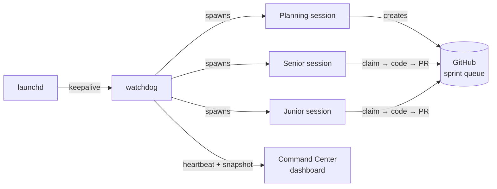
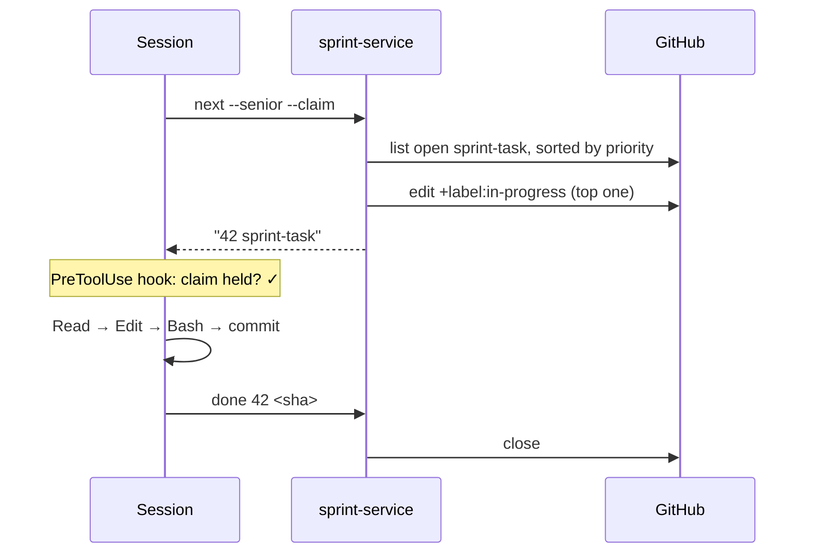
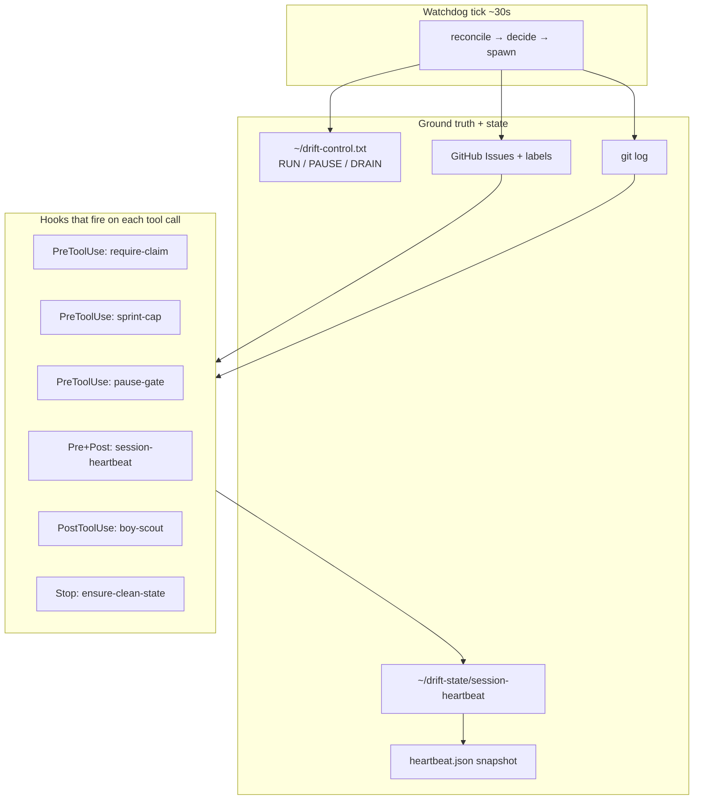

# The app that ships itself

*Notes from engineering a one-person autonomous dev loop.*

I've never built an iOS app before. Drift is my first.

It has twenty-five beta users right now — friends, friends of friends, a few teammates, some family — running it on TestFlight. When one of them hits a bug, it usually gets diagnosed, patched, tested, committed, and queued for the next build within **ten minutes**. Unless the loop is mid-market-research, in which case I might have to wait an hour until it finishes reading about what MyFitnessPal shipped last week.

That sentence shouldn't be possible. A first-time iOS developer doesn't close user bug reports in ten minutes on a Saturday morning while his laptop sits closed on the kitchen counter. I barely know half the framework. But it is possible, because Drift is not the only thing I built. I also built the *harness* that builds Drift — and the harness is the one doing most of the work.

This post is about that harness. What it does, what I had to get right to keep it honest, what it sounds like when it argues with me about product priority, and how you can build one yourself.

---

## The app, briefly

Drift is an all-in-one health app built on a simple premise: your food, exercise, weight, and mood data should stay on your device, and the intelligence on top of it should be yours to configure — not ours to resell.

In practice, that means three things:

- **Analytics on top of Apple Health.** Behavior logging for food and exercise gets layered on what Apple Health already tracks — one unified view, no sync drama. A small on-device language model turns natural-language entries like *"log breakfast: two eggs, toast, and coffee with milk"* or *"I did four sets of squats at 60kg"* into structured logs. Private data stays on the device. Never touches the network. If you wear a CGM, Drift joins its readings against your food logs to answer questions like *"does my glucose spike after rice?"* — locally, on your phone.
- **Bring-your-own-key for heavier work.** For tasks where a remote frontier model is actually better — photo meal logging is the obvious one — you plug in your existing Anthropic, OpenAI, or Gemini API key. Keys live in iOS Keychain. Drift talks to the provider directly from your phone. You pay them directly. No proxy. No account. No subscription. Only the payload you chose to upload (the photo) goes on the wire — never your profile, your history, or your identity.
- **No-service architecture.** No accounts, no subscriptions, no server to hold your data hostage. Drift is a client you run; the intelligence is whatever you configure it to use. The only backend is your phone.

That's the app. I hope you try it.

But what I actually want to write about is how it gets built. A year ago, a first-time iOS developer could not have shipped something like this on nights and weekends — not because the idea was wrong, but because the infrastructure to *build* it didn't exist yet. The frontier models got good enough at software engineering that the interesting work moved up the stack: from writing code to designing the environment in which code gets written. The scaffolding around the agent is where the leverage lives. For an indie developer, that scaffolding is the difference between *"this works for a demo"* and *"this ships every Tuesday."*

This post is about what that scaffolding looks like when one person does it, nights and weekends, for an app that ships to real users. Four patterns I had to get right. Four I got wrong first. A few higher-level lessons underneath them. And a zip file at the bottom with every script, hook, and dashboard wire, so you can build a version of this for whatever you're working on.

---

## A week in the life of the loop

Here's what Drift's autopilot did during the seven days before I wrote this post.

It pushed **409 commits** across the repo. I wrote zero lines of that code.

It shipped **nine user-visible features**, including: a Photo Log overhaul with editable macros, per-provider model picker, and AI-returned serving hints; a `cross_domain_insight` tool that answers correlational queries like *"does my glucose spike after rice?"* by joining food logs against CGM data pulled through Apple Health; a `weight_trend_prediction` tool that projects the date you'll hit your goal weight; an expansion of the intent-routing eval harness from 120 to 175+ test cases; and a full redesign of the Command Center activity dashboard down to an ECG-style heartbeat strip.

It closed **thirty distinct bug issues**, most of them from real user reports. A five-bug bundle landed in a single fix commit after a friend sent me a handful of Photo Log screenshots over iMessage one evening.

It published **six daily exec reports** as merged PRs — each with a headline, a "what's working well" list, a risk list, and a "decision needed" line at the bottom waiting for me to tap approve. One of them opened like this:

> *"Photo Log overhauled with editable macros, multi-provider model picker, and AI serving units — plus cross-domain correlational queries now live ('do I spike after rice?')."*

And it ran **nine full product reviews**, roughly one every day the planning cycle tripped the twenty-cycle trigger. I'll get to one of them in a minute.

I did none of the code. I approved most of the reviews. I closed my laptop a lot.

### A representative bug-fix-in-eleven-minutes story

Here's an actual example, timestamps and all, from two days ago — issue #220.

A beta user files a bug from inside the app via the "Report Issue" flow. Title: *"Not able to edit ingredient list when I edit a recipe or meal from food diary."* The body, verbatim:

> *"Just lists down ingredients but no option to edit. Show the same view when it was added."*

The user attaches a screenshot. The issue is filed at `13:24:57` UTC with a `P0` label.

The watchdog, which ticks every thirty seconds and reconciles against GitHub, notices the new `P0-bug` on its next pass. Within a minute, a senior Claude Code session spawns. It runs atomic `next --senior --claim`, which returns the highest-priority task and marks it `in-progress` in the same call. It reads the full issue including the screenshot attached to the body. It posts a plan comment before touching any code — the `PreToolUse` hook refuses to let it `Edit` or `Write` without one. It patches the affected view, runs the unit tests, watches them pass, commits, pushes.

Eleven minutes and nineteen seconds after the issue was filed, at `13:36:16` UTC, GitHub's timeline shows the fix commit and the `in-progress → closed` transition, in that order.

I was walking the dog.

That story happens somewhere between three and ten times a week. Not every bug closes that fast — some need a design, some need me to make a product call — but most of the shallow ones do. The key word is *shallow*: a problem whose diagnosis is "read the thread, look at the screen recording, trace one function" is exactly what this loop is good at. It's the depth of work where the harness *isn't* the bottleneck — I am. When I have an opinion, the harness waits for my comment. When I don't, it ships.

### Tuesday — the harness studies the competition

Every twenty planning cycles, the watchdog fires a *product review* session. It reads two persona files — a Product Designer and a Principal Engineer I invented early on — web-searches the competition, and writes a full review as a merged PR. The one from this week opens like this:

> *"**MyFitnessPal:** Winter 2026 release is shipping through April: photo-upload meal scanning (Cal AI integration, Premium+ only), Blue Check dietitian-reviewed recipes, GLP-1 medication tracking with dose/timing reminders, and a redesigned Today tab with streaks and habit-tracking. Premium+ still $20/month. Their AI food logging is cloud-dependent and paywalled — our free on-device chat remains a genuine differentiator."*

> *"**Whoop:** Behavior Trends (habit → Recovery correlation after 5+ log entries) is now live with calendar views. The Behavior Trends pattern is exactly our `cross_domain_insight` direction — and Whoop has it shipping while `supplement_insight` and `food_timing_insight` sit queued. On-device privacy is still our counter."*

The second quote isn't just analysis. It's an *argument*. The Product Designer persona is telling me, the human, that I've been sitting on two features for 160+ planning cycles while a competitor shipped an equivalent. It's *pushing back* on my implicit priority.

Then the two personas argue about it, in the PR itself:

> **Designer:** *"The queue-cap was the right call six cycles ago and it's still right. We're at 101. Every new task added today is a task that will be 2,000 cycles old before it ships. I'm going to advocate for a hard rule: this planning session creates ≤4 new tasks — P0 bugs, mandatory eval run, and State.md refresh only. No new feature tasks until the queue drops below 70."*
>
> **Engineer:** *"I support the spirit, but program.md requires 8+ tasks as DOD for this session. I don't want to create tasks for the sake of it — but there are two legitimate gaps that aren't in the current queue..."*

They negotiate. They arrive at an "Agreed Direction." Then the review ends with three specific *Decisions for Human* — numbered questions pinned to my attention, like:

> *"**Hard queue cap:** Should the planning DOD be updated in program.md to require 'queue < 70 before creating new non-P0 tasks'? This would surface the structural tension instead of quietly ignoring it every cycle."*

I read it in bed. I tap approve on one, reply "let's defer" on another. The harness picks up my replies on the next planning cycle and adjusts.

This is the part that surprised me most when I first saw it work end-to-end: the harness is not just building features. It is *studying the market, taking a position, defending the product, and educating me about what to prioritize*. When MyFitnessPal announced GLP-1 medication tracking, I didn't hear about it from the tech press. I heard about it from my own autopilot, in a PR that explained what it meant for Drift.

### Wednesday night — the personas who've been learning

The Product Designer and Principal Engineer personas aren't prompts I wrote once and walked away from. They're Markdown files the harness appends to after every product review. They've now been through fifty-four of these reviews.

The early entries are where you can see the shape of a persona that doesn't know much yet. From the Designer's Review #11, about 200 cycles ago:

> *"Spent too many cycles on blanket code refactoring (code-improvement loop) instead of user-facing features. Merged into single autopilot loop."*

Useful, but surface-level — an observation about what happened, not yet a principle.

By Review #17 (cycle 620), the same persona:

> *"Systematic bug hunting (running an analysis agent across pipeline files) found 4 silent data-accuracy bugs. This should be a quarterly ritual, not just reactive."*

It's starting to generalize — moving from "we did a thing" to "we should do this class of thing periodically."

By Review #54 (cycle 5351, last week), the Designer is making executive-level product calls, quoting competitive intel, and telling me when I'm wrong:

> *"Review #53 named them P0 for the very next senior session. They're still in queue. Whoop is now demonstrating exactly this pattern (Behavior Trends) to their 4M+ users. We built `cross_domain_insight` first — we have the pattern, the schema, and the service layer. Not shipping these two tools is a competitive mistake that compounds every cycle."*

You can watch the Engineer persona evolve the same way. Review #11 is full of "we fixed X, lesson was Y" observations. Review #54 has recommendations like:

> *"Two mechanical changes this cycle: (1) Require State.md refresh as a gated pre-condition before writing any product scorecard in future reviews — add it explicitly to planning checklist step 6. (2) For `supplement_insight` and `food_timing_insight`: the AnalyticsService infrastructure from `cross_domain_insight` is already there — implementation is 1–2 new service query methods plus schema. This can ship in a single senior session if scoped correctly."*

That's not a lessons-learned bullet. That's a senior engineer writing a mini-RFC. It knows the codebase's existing patterns, it scopes the work, it predicts what will ship in one session. And it got there not because I wrote a better prompt — I've never edited the Engineer persona by hand — but because every review ends with a block titled *"What I Learned — Review #N"*, and those blocks stack up and become the context for every subsequent cycle.

The personas, in other words, are growing with the product. They have a memory that survives session deaths. They develop taste. They start pushing back. Once in a while I disagree with them. More often now, they're right.

---

## What the harness is, briefly

I can run Drift's development loop in three modes:

- **Human-shepherded.** I'm at the keyboard. Claude Code is my pair. Nothing special.
- **Autopilot.** I type *"run autopilot"* and the loop runs in the foreground on a program file — sprint tickets → implement → test → commit. Ctrl-C to stop. No supervisor.
- **Drift Control.** A shell script called the **watchdog** supervises the whole loop. Sessions fire one at a time on my laptop — no sandboxes, no parallel worktrees. A **planning** session every six hours refreshes the sprint. A **senior** session picks up complex work. A **junior** session clears the simpler stuff. ("Senior" and "junior" are not skill tiers; they're just a more-expensive vs. cheaper model, each with a five-task budget.) Between those, the watchdog fires special-purpose sessions — design-doc reviews, product reviews every twenty cycles, daily exec reports, TestFlight publishes every three hours. If a session dies, the watchdog restarts it. If the watchdog dies, `launchd` restarts *it*. I can be offline for days.



Sprint-task coding is maybe 60% of what all this does. The other 40% is the meta-work you saw in the week-in-the-life section: draining process feedback into the harness's own backlog, triaging feature requests, replying to admin comments on PRs, writing product reviews, updating personas and roadmap, publishing exec reports. Separately the senior session owns **design docs** — it finds issues that need one, writes it on a branch, PRs it, and once approved creates the implementation sub-tasks and refreshes the sprint.

And the testing? Stratified by layer, not outsourced to a remote device farm. Roughly 1,700 unit tests hit a real SQLite database via GRDB — no mocks, because mocking a database was the fastest way I found to ship migration bugs. A simulator integration layer runs the SwiftUI flows via `xcodebuild test`. An LLM eval harness runs scripted prompts against the on-device model in a test host and scores them against expected intents and tool calls. And a separate laptop-only regression suite (~200 cases) tests the watchdog state machine itself. TestFlight is the substitute for a device farm: twenty-five users on twenty-five real phones, sending feedback that feeds right back into the loop.

### Where this sits, in context

If you've followed agentic coding over the last year, you've probably seen [**Geoffrey Huntley's Ralph loop**](https://ghuntley.com/ralph/) (or the [Ralph Wiggum technique](https://github.com/ghuntley/how-to-ralph-wiggum) it grew into) — a deliberately minimal `while true` around an AI coding agent that reads a spec file, picks one task, implements it, exits, and starts a fresh process on the next iteration. Each loop gets a clean context window; progress persists in files and git, not in the model's memory. It's elegant, and it's shipped real work overnight on meaningful budgets — one widely-cited example delivered a ~$50K scope for under $300 in API costs. The philosophy is simple: don't aim for perfect on the first try; let the loop refine the work.

Drift Control is that instinct, grown up. The inner loop is still there — the watchdog's tick is the outer `while true`, and each session fires, does one bounded unit of work, and exits. What's around it is the scaffolding you need once you care about running unattended for *weeks* instead of hours: a supervisor tree so the loop restarts itself when something upstream dies; a domain-specific state machine (GitHub issues as the queue, labels as the hand-off protocol); enforcement hooks that refuse invalid operations; a dashboard that tells me from my phone whether the line is moving. If Ralph is the engine, Drift Control is the engine plus the dashboard, the oil light, and the seatbelt.

One framing point worth flagging upfront: this is deliberately **not** a general-purpose personal agent. A "do anything for me" agent is too broad — it has no natural ground truth to reconcile against, and no domain-shaped state machine to run on. Drift Control is the opposite: a narrow harness for one job (shipping a specific iOS app), and most of what makes it tractable leans on the narrowness. Git, GitHub, `xcodebuild`, TestFlight — those are the anchors reconciliation needs. If the ambition had been "personal assistant for my whole life," none of the patterns below would be available, because the state wouldn't live anywhere I could read it. Narrow beats broad, for this class of system. At least with today's models.

---

## Four things that actually matter

Of everything I tried, four patterns turned out to be non-negotiable. Each came from a specific, embarrassing failure. I'll describe the failure, then the pattern.

### 1. Reconcile with ground truth every tick. Don't trust memory.

**The failure.** One Saturday I noticed the watchdog had run eleven consecutive planning sessions in four hours. Zero code shipped. The sessions kept firing *because the planning-due check read a stamp file that the session was supposed to write — and the session kept partially executing and dying before it wrote the stamp*. The harness was asking itself "when did I last plan?" and the answer was forever "never."

**The pattern.** No session-written stamps. Every gate in the watchdog loop reconciles against an **external, durable store** — git log, GitHub's issue API, the filesystem. Not against something an earlier session (or an earlier *me*) claimed was true.

| Gate | Old implementation | New implementation |
|---|---|---|
| Planning-due? | read stamp file | `git log --grep='planning complete'` |
| TestFlight-due? | read stamp file | `git log --grep='TestFlight build'` |
| What's in progress? | read local state | `gh issue list --label in-progress` |
| Report already merged? | read stamp | `gh pr list --state merged --label report` |

The rule: **if an LLM-driven session wrote it, I can't trust it stayed true.** Sessions die, crash, partially execute, panic-exit, run out of context. Reconcile from the durable store on every tick. It costs more in API calls. It's worth it.

### 2. Make work visible, atomically.

**The failure.** I watched a senior session spend twenty minutes "investigating" a task. No `in-progress` label. No claim. No visible indication anywhere that it was working. It eventually crashed, and a second session spun up and picked up the same task from scratch. Classic **peek-without-claim**.

**The pattern.** One atomic call that returns the next task *and* marks it in-progress under the same lock:

```bash
TASK=$(scripts/sprint-service.sh next --senior --claim)
```

The caller never sees an unclaimed task it's about to work on. Then a `PreToolUse` hook refuses to let `Edit` or `Write` fire unless the session is holding at least one claim. Ghost work becomes impossible — the tool literally won't run.



If the dashboard shows nothing in progress, nothing is in progress — not "nothing that logged to this place."

### 3. Liveness needs its own signal.

**The failure.** I was using log-file modification time as the signal for "is this session still alive?" It lied. During long generation bursts — the model thinking for ninety-plus seconds before producing any tool call — the log didn't move. The watchdog declared the session stalled and killed it. Mid-thought.

**The pattern.** A dedicated heartbeat. `PreToolUse` and `PostToolUse` hooks fire a three-line script that writes `$(date +%s)` to `~/drift-state/session-heartbeat`. The watchdog reads the heartbeat file — not the log — to decide liveness. **Tool calls are the pulse.** They're also the only meaningful indicator of activity in an LLM agent; reasoning without a tool call is invisible by design.

Piped into the dashboard, it looks like this:

```
Session heartbeat (last 4h)           Peak burst: 34 calls / 5min
  ▁▁▁▂▂▃▄▅▅▆▇▇▆▅▄▃▂▁▁▁▂▃▄▅▆▇█▇▆▅▃▂▁▁▁▂
  │       senior start    senior done   │   planning
```

When I glance at my phone at 11pm and the line is flat, I know. When it's moving, I go to bed.

### 4. Every supervisor needs a supervisor.

A session can crash → the watchdog restarts it. The watchdog itself can crash → nothing restarts it. I'd wake up to twelve hours of silence.

So: `launchd` plist. `KeepAlive=true`, `ThrottleInterval=30`. If the watchdog exits for any reason, launchd relaunches it within thirty seconds. Survives reboots. Survives me closing the terminal by accident.

```
launchd (OS) ─┐
              │ keepalive=true, throttle=30s
              ▼
           watchdog (bash loop)
              │ spawn + restart on crash/stall
              ▼
           claude-code session (planning|senior|junior)
              │ PreToolUse / PostToolUse hooks
              ▼
           tool call → commit → push
```

Ten seconds of setup for infinite peace of mind. The general pattern: **every long-running process in your harness needs a parent that outlives it.** All the way up until you hit the OS.

---

## Four things I got wrong first

Not exhaustive. Just the ones embarrassing enough to publish.

**Release-note hallucinations.** The watchdog was supposed to publish a daily exec report as a merged PR. It published many. Then I noticed the Command Center wasn't listing any of them. The watchdog's PR-merge step never added the `report` label, and the dashboard filtered by label. The work happened. The output vanished. Fix: self-heal at merge time — if the branch name matches a report pattern and the label is missing, add it before merging. One chokepoint, one reconciliation.

**Stamp drift.** Version one was "session writes a stamp when it finishes, watchdog reads the stamp." That only works if sessions always finish. They don't. Version two was §1 above.

**Parallel test deadlocks.** I tried running unit tests and the LLM eval harness concurrently. Both drove `xcodebuild test` against the same simulator. They locked up. Fix: a hook that `pkill -9`s stale `xcodebuild` before the next test run. The deeper lesson: *shared singletons* — the simulator, the git index, the food DB seed — are hostile to parallel agents. Your harness has to know what's shared.

**Sprint-queue runaway.** Early autopilot cycles were over-enthusiastic about creating sprint tasks. The queue hit 400+ open issues before I looked. Planning sessions started getting lost triaging their own backlog. A `PreToolUse` hook now blocks `gh issue create --label sprint-task` when the open count is ≥100, and planning quality jumped the day I added it. Planning quality is inverse to queue size.

---

## The enforcement map

What makes this tractable for one person is that the enforcement lives in *small, ugly shell scripts* plugged into Claude Code's hook system, not in a platform. The watchdog is ~400 lines of bash. Each hook is ~30. The state is files. The dashboard is a static HTML page served from GitHub Pages. Nothing you can't reproduce on a laptop.



The four gaps, and the four patterns that close them:

| Gap | Pattern |
|---|---|
| Memory can lie | Reconcile with ground truth |
| Work can be invisible | Atomic claim + visible-lock gate |
| Silence can be activity | Dedicated liveness channel |
| Supervisors can die | Supervise your supervisor |

---

## Higher-level lessons, pulled up from the specifics

The four patterns are specific. Zooming out, three more general observations became obvious once I'd been running this loop for a few months.

### The agent isn't the product you own.

Models change. What persists — and what you actually own — is the harness: the queue, the hooks, the reconciliation, the dashboards, the test suite, the replay tooling, the personas. If you pour all your craft into clever prompts, you've invested in something a model update will subsume. If you pour it into the harness, it compounds. The model is a swappable component; the scaffolding is the asset. Personas are part of that scaffolding — they're the longest-lived artifact in this whole system.

### Agents are a distributed-systems problem, not a language-model problem.

Every unglamorous distributed-systems pattern reappears, one at a time, the moment you let an LLM run unsupervised: atomicity, idempotency, liveness, supervisor trees, clock skew, partial failure, leader election, exactly-once semantics. The good news is these are well-understood and half a century old. The bad news is most people building on agents haven't touched them since their systems-design interview. When something feels hard or weird about your agent, ask the systems question first — *"is this a race?"* *"what's my fencing token?"* — before the prompt question.

### The feedback loop is the architecture.

The version of the harness I started with did not close its own feedback loop. When autopilot hit a systemic problem — a rate limit, a flaky test, a bad pattern the model repeated — I had to notice and fix it manually. That scales to about a weekend. The version in this repo files its own process-feedback as tickets; the planning session drains them into the next sprint; systemic issues graduate into `infra-improvement` tasks the harness then picks up and works on. The personas remember the lessons. If your harness can't feed its own failure modes back into its own queue, *you* are the feedback loop — and that's a job that doesn't fit in a day. Designing the loopback is the architecture, not a nice-to-have.

---

## Why this matters if you're not me

The specific app is incidental. The pattern isn't.

If you're building anything where an AI agent does real work unsupervised — background jobs, scheduled tasks, code-review bots, dev loops, customer-facing agents, operator workflows — the product you ship isn't the agent's output. It's the **confidence interval** around that output. And the confidence interval is a function of how well you engineered:

- ground-truth reconciliation,
- atomic work claims,
- liveness signals,
- supervisor trees,

…and a handful of other things I'm still learning.

The encouraging part: none of this requires a platform. A solo developer — one who had never built an iOS app before, in my case — with bash, cron, and a GitHub repo can build something correct enough to run without them. The bottleneck isn't infrastructure. It's whether you've thought clearly about *what can lie, what can vanish, and what can die.*

---

## Replicate it

Everything is zipped at [`drift-command-center-replicate.zip`](./drift-command-center-replicate.zip) in this folder:

- `program.md` — the autopilot program the watchdog drives
- `.claude/settings.json` + `.claude/hooks/*.sh` — every enforcement hook (`require-claim`, `sprint-cap`, `session-heartbeat`, `guard-testflight`, `pause-gate`, …)
- `scripts/self-improve-watchdog.sh` — the watchdog
- `scripts/sprint-service.sh`, `planning-service.sh`, `issue-service.sh`, `design-service.sh`, `report-service.sh` — the state-machine CLIs the sessions call
- `scripts/session-monitor.sh` — live summaries via a smaller model
- `scripts/heartbeat-snapshot.sh` — log → JSON for the dashboard
- `scripts/install-watchdog.sh` + `com.drift.watchdog.plist` — launchd supervision
- `command-center/` — the dashboard (static HTML/JS)
- `REPLICATE.md` — one-page quickstart for adapting it to a different repo

It isn't a framework. It's a kit. Cut and paste what you need, replace the Drift-specific bits, keep the shape.

---

*Drift is in TestFlight with twenty-five beta users. The code is at [github.com/ashish-sadh/Drift](https://github.com/ashish-sadh/Drift). This harness has shipped roughly 170 builds of it, and by the time you read this probably more. I did not write the iOS code. I don't want to pretend otherwise. What I did build is the thing around it — the engine, the dashboard, the oil light, and the seatbelt — and that's the part I think is worth sharing.*
