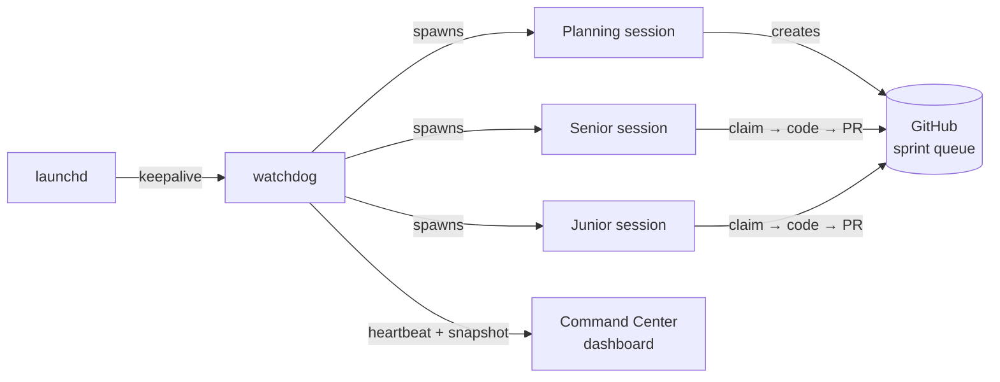
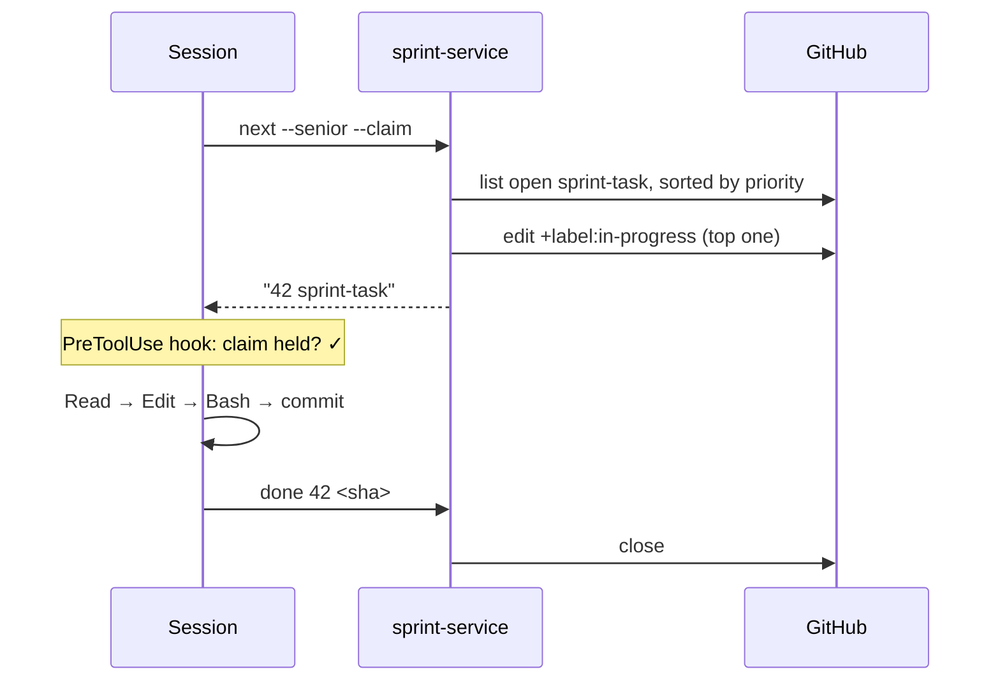
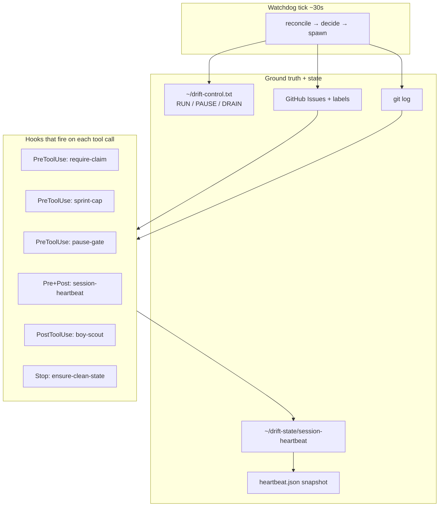

# The app that ships itself

*Notes from engineering a one-person autonomous dev loop.*

I built an iOS app called **Drift**. It's a privacy-first health tracker that runs a small language model on-device — you can talk to it like you'd talk to a friend about what you ate, and it handles the logging. Nothing leaves your phone. That's the app. I hope you try it.

But that's not really what this post is about.

What I actually built — and what I think is worth writing about — is the **harness**. A small, opinionated system that plans sprints, picks tickets, writes code, runs tests, ships TestFlight builds, and files daily reports into Drift without me at the wheel. Most days, the harness is the one doing the work. I read the reports.

If that sounds ridiculous for a solo developer, it should. A year ago it would have been. The only reason it works now is that the frontier models got good enough at software engineering that the interesting work moved up the stack — from writing code to designing the environment in which code gets written. OpenAI recently put a name on this shift: [**harness engineering**](https://openai.com/index/harness-engineering). The scaffolding around the agent is where the leverage lives.

This post is about what harness engineering looks like when one person does it, on nights and weekends, for an app that ships to real users. Four patterns I had to get right. Four I got wrong first. And a zip file at the bottom with every script, hook, and dashboard wire, so you can build a version of this for whatever you're working on.

---

## 1. What the harness does, at a glance

I can run Drift's development loop in three modes:

- **Human-shepherded.** I'm at the keyboard. Claude Code is my pair. Nothing special.
- **Autopilot.** I type *"run autopilot"* and Claude Code loops on a program file — sprint tickets → implement → test → commit. Foreground. Ctrl-C to stop. No supervisor.
- **Drift Control.** A shell script called the **watchdog** supervises the whole loop. It spawns planning sessions, senior-engineer sessions, junior-engineer sessions. It publishes TestFlight builds on a cadence. It writes daily exec reports as PRs. If a session dies, it restarts it. If the watchdog dies, `launchd` restarts *it*. I can be offline for days.



The meta-interesting thing isn't that it works — LLMs are capable enough today. It's *what breaks when it runs unsupervised for days*, and what you have to engineer to keep it truthful.

Three processes at the top of that chain that you might not expect: `launchd → watchdog → session`. Every supervisor has a supervisor. I ended up there not out of paranoia but because anything I didn't supervise eventually failed silently and wasted a weekend.

---

## 2. Four things that actually matter

Of everything I tried, four patterns turned out to be non-negotiable. Each one came from a specific, embarrassing failure. I'll describe the failure, then the pattern.

### 2.1 Reconcile with ground truth every tick. Don't trust memory.

**The failure.** One Saturday I noticed the watchdog had run 11 consecutive planning sessions in four hours. Zero code shipped. The sessions kept firing *because the planning-due check read a stamp file that the session was supposed to write — and the session kept partially executing and dying before it wrote the stamp*.

The harness was asking itself "when did I last plan?" and the answer was forever "never."

**The pattern.** No session-written stamps. Every gate in the watchdog loop reconciles against an **external, durable store** — git log, GitHub's issue API, the filesystem. Not against something an earlier session (or an earlier *me*) claimed was true.

| Gate | Old implementation | New implementation |
|---|---|---|
| Planning-due? | read stamp file | `git log --grep='planning complete'` |
| TestFlight-due? | read stamp file | `git log --grep='TestFlight build'` |
| What's in progress? | read local state | `gh issue list --label in-progress` |
| Report already merged? | read stamp | `gh pr list --state merged --label report` |

The rule I learned the hard way: **if an LLM-driven session wrote it, I can't trust it stayed true.** Sessions die, crash, partially execute, panic-exit, run out of context. Reconcile from the durable store on every tick — git and GitHub are always right; your local cache might be stale.

This one costs more in API calls. It's worth it.

### 2.2 Make work visible, atomically.

**The failure.** I watched a senior session spend twenty minutes "investigating" a task. No `in-progress` label. No claim. No visible indication anywhere that it was working. It eventually crashed, and a second session spun up and picked up the same task from scratch.

This is a classic distributed-systems gap: **peek-without-claim**. The session reads the queue, decides what to work on, but hasn't yet marked it as taken. Between those two operations, anything can happen.

**The pattern.** One atomic call that returns the next task *and* marks it in-progress in the same script invocation, with a lock file held across both operations:

```bash
TASK=$(scripts/sprint-service.sh next --senior --claim)
```

The caller never sees an unclaimed task it's about to work on. Then, a `PreToolUse` hook refuses to let `Edit` or `Write` fire unless the session is holding at least one claim (with an escape hatch for planning/report branches). Ghost work becomes impossible — the tool literally won't run.



The harness stops being able to do invisible work. If the dashboard shows nothing in progress, nothing is in progress — not "nothing that logged to this place."

### 2.3 Liveness needs its own signal.

**The failure.** I was using log-file modification time as the signal for "is this session still alive?" It lied. During long generation bursts — the model thinking for 90+ seconds before producing any tool call — the log didn't move. The watchdog declared the session stalled and killed it. Mid-thought. I lost real work that way.

**The pattern.** A dedicated heartbeat. `PreToolUse` and `PostToolUse` hooks fire a three-line script that writes `$(date +%s)` to `~/drift-state/session-heartbeat` and appends to `session-heartbeat.log`. The watchdog reads the heartbeat file — not the log — to decide liveness.

**Tool calls are the pulse.** They are also the only meaningful indicator of activity in an LLM agent; reasoning without a tool call is invisible by design.

Then I piped that log into a dashboard. Every 10 minutes (or whenever the watchdog commits something else) a snapshot script bucketizes the log into `heartbeat.json`, and the Command Center renders a little ECG strip:

```
Session heartbeat (last 4h)           Peak burst: 34 calls / 5min
  ▁▁▁▂▂▃▄▅▅▆▇▇▆▅▄▃▂▁▁▁▂▃▄▅▆▇█▇▆▅▃▂▁▁▁▂
  │       senior start    senior done   │   planning
```

When I glance at my phone at 11pm and the line is flat, I know. When it's moving, I go to bed.

### 2.4 Every supervisor needs a supervisor.

This one's unglamorous. I resisted it for a while. Eventually I gave in.

- A **session** can crash → the watchdog restarts it.
- The **watchdog** itself can crash (shell panics, Mac reboots, something OOMs) → nothing restarts it. I'd wake up to 12 hours of silence.
- So: `launchd` plist. `KeepAlive=true`. `ThrottleInterval=30`. If the watchdog exits for any reason, launchd relaunches it within 30 seconds. Survives reboots. Survives me closing the terminal by accident.

```
launchd (OS) ─┐
              │ keepalive=true, throttle=30s
              ▼
           watchdog (bash loop)
              │ spawn + restart on crash/stall
              ▼
           claude-code session (planning|senior|junior)
              │ PreToolUse / PostToolUse hooks
              ▼
           tool call → commit → push
```

Installation is ten seconds of setup for infinite peace of mind:

```bash
./scripts/install-watchdog.sh install
# loads com.drift.watchdog.plist into launchctl
```

The general pattern: **every long-running process in your harness needs a parent that outlives it.** All the way up until you hit the OS.

---

## 3. Four things I got wrong first

Not exhaustive. Just the ones embarrassing enough to publish.

**Release-note hallucinations.** The watchdog was supposed to publish a daily exec report as a merged PR. It published many. Then one day I noticed the Command Center wasn't listing any of them. The watchdog's PR-merge step never added the `report` label, and the dashboard filtered by label. The work happened. The output vanished. Fix: self-heal at merge time — if the branch name matches a report pattern and the `report` label is missing, add it before merging. One chokepoint, one reconciliation. (This is §2.1 again, in miniature.)

**Stamp drift.** The version-one approach was "session writes a stamp when it finishes, watchdog reads the stamp." That only works if sessions always finish. They don't. Version two was §2.1.

**Parallel test deadlocks.** I tried running unit tests and the LLM eval harness concurrently. Both drove `xcodebuild test` against the same simulator. They locked up. Fix was unglamorous: a hook that `pkill -9`s stale `xcodebuild` before the next test run. The deeper lesson: *shared singletons* (the simulator, the git index, the food DB seed) are hostile to parallel agents. Your harness has to know what is shared.

**Sprint-queue runaway.** Early autopilot cycles were over-enthusiastic about creating sprint tasks. The queue hit 400+ open issues before I looked. Planning sessions started getting lost triaging their own backlog. A `PreToolUse` hook now blocks `gh issue create --label sprint-task` when the open count is ≥100, and planning quality jumped the day I added it. Turns out planning quality is inverse to queue size.

---

## 4. The method, applied to a small app

Drift isn't Stripe. It has one developer. But the patterns above aren't size-gated — they're **agent-gated**. Any time you have an LLM doing work unsupervised, the same four gaps open up:

| Gap | Pattern |
|---|---|
| Memory can lie | Reconcile with ground truth |
| Work can be invisible | Atomic claim + visible-lock gate |
| Silence can be activity | Dedicated liveness channel |
| Supervisors can die | Supervise your supervisor |

What made this tractable for one person is that the enforcement lives in *small, ugly shell scripts* plugged into Claude Code's hook system, not in a platform. The watchdog is ~400 lines of bash. Each hook is ~30. The state is files — `~/drift-state/*` and `~/drift-control.txt`. The dashboard is a static HTML page served from GitHub Pages. Nothing you can't reproduce on a laptop.



It is modest. It should be.

---

## 5. Why this matters if you're not me

The specific app is incidental. The harness philosophy isn't.

If you're building anything where an AI agent does real work unsupervised — background jobs, scheduled tasks, code-review bots, dev loops, customer-facing agents, operator workflows — you are a harness engineer whether you use that title or not. The product you ship isn't the agent's output. It's the **confidence interval** around that output. And the confidence interval is a function of how well you engineered:

- ground-truth reconciliation,
- atomic work claims,
- liveness signals,
- supervisor trees,

and a handful of other things I'm still learning.

OpenAI's [harness engineering post](https://openai.com/index/harness-engineering) is worth reading — it names and shapes this discipline from the frontier-lab perspective. What I want to add is: **it scales down**. A solo developer with bash, cron, and a GitHub repo can build a harness correct enough to run without them. The bottleneck isn't infrastructure. It's whether you've thought clearly about *what can lie, what can vanish, and what can die.*

---

## 6. Replicate it

Everything is zipped at [`drift-command-center-replicate.zip`](./drift-command-center-replicate.zip) in this folder:

- `program.md` — the autopilot program the watchdog drives
- `.claude/settings.json` + `.claude/hooks/*.sh` — every enforcement hook (`require-claim`, `sprint-cap`, `session-heartbeat`, `guard-testflight`, `pause-gate`, …)
- `scripts/self-improve-watchdog.sh` — the watchdog
- `scripts/sprint-service.sh`, `planning-service.sh`, `issue-service.sh`, `design-service.sh`, `report-service.sh` — the state-machine CLIs the sessions call
- `scripts/session-monitor.sh` — live summaries via a smaller model
- `scripts/heartbeat-snapshot.sh` — log → JSON for the dashboard
- `scripts/install-watchdog.sh` + `com.drift.watchdog.plist` — launchd supervision
- `command-center/` — the dashboard (static HTML/JS)
- `REPLICATE.md` — one-page quickstart for adapting it to a different repo

It isn't a framework. It's a kit. Cut and paste what you need, replace the Drift-specific bits, keep the shape.

---

*Drift is in TestFlight. The code is at [github.com/ashish-sadh/drift](https://github.com/ashish-sadh/drift). This harness has shipped Drift build 147 and counting — I'd say exclusively, but I check on it.*
